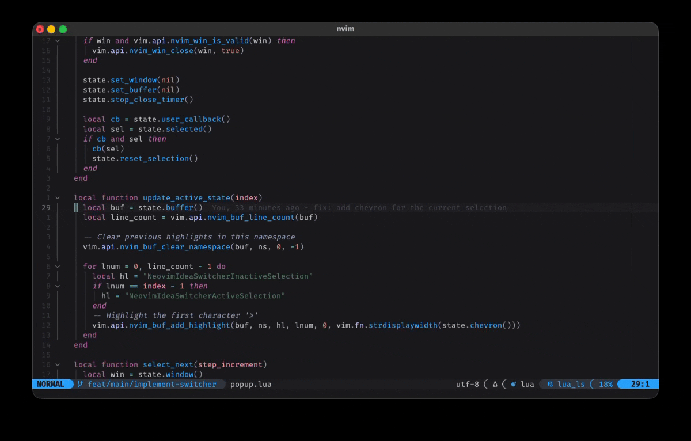

## switcher-nvim

A simple, yet powerful switcher, similar to JetBrain's one.



Requirements:

* plenary
* nerdfonts


## Installation

### Lazy
```lua
{
  "neovim-idea/switcher-nvim",
  dependencies = {
    "nvim-lua/plenary.nvim",
    "nvim-tree/nvim-web-devicons"
  },
}
```

### Packer
```lua
use {
  "neovim-idea/switcher-nvim",
  requires = {
    "nvim-lua/plenary.nvim",
    "nvim-tree/nvim-web-devicons"
    }
}
```

### Plug
```lua
Plug "nvim-lua/plenary.nvim"
Plug "nvim-tree/nvim-web-devicons"
Plug "neovim-idea/switcher-nvim"
```

## Setup


## Todo

- [ ] add tests!
- [x] start from the 2nd
- [ ] walk the list in reverse order via `C-S-Tab`
  - [ ] and start from the 2nd to last element (no nee)
