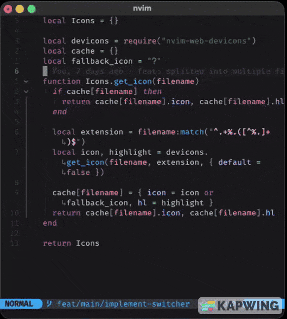
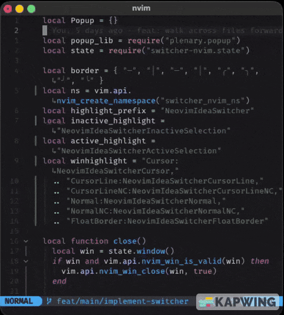
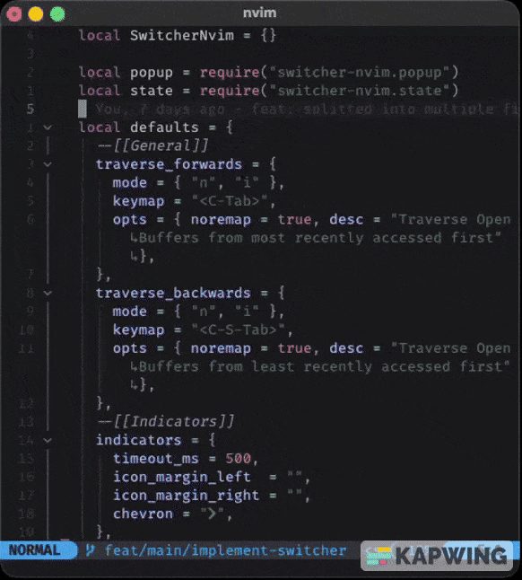
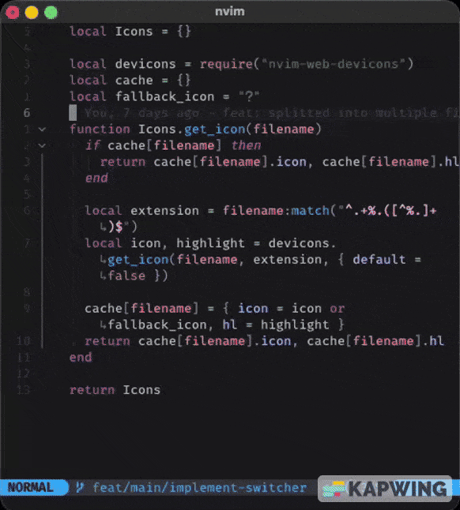

<div align="center">

[](https://github.com/neovim-idea/switcher-nvim/releases)
[](http://www.lua.org)
[](https://neovim.io)

## switcher-nvim

###### JetBrain's file switcher, for neovim :heart_eyes:

|          DEFAULT (JetBrains)          | CHEVRON                               |                ICON MARGINS                |                MIXED                |
|:-------------------------------------:|---------------------------------------|:------------------------------------------:|:-----------------------------------:|
|  |  |  |  |

</div>

<!-- TOC -->

* [Usage](#usage)
* [Installation](#installation)
    * [Lazy](#lazy)
    * [Packer](#packer)
    * [Plug](#plug)
* [Setup](#setup)
* [Styling](#styling)
* [Todo](#todo)
* [Buy me a :beer:](#buy-me-a-beer)

<!-- TOC -->

## Usage

Hit `<C-Tab>` to open the switcher; hit it some more to select the buffer you're interested into. If you don't do
anything for `500ms` (configurable, see below), the popup will close, and the selected buffer will be displayed.

`<C-Tab>` traverses buffers from the most recently opened, to the oldest; if you want to "go back" to a previous buffer
in the list, simply hit `<C-S-Tab>` as many times as you need.

Also, `<C-S-Tab>` does open the switcher, but it will start from the bottom of the list (aka the oldest buffer you've
opened).

## Installation

Requirements:

* [plenary.nvim](https://github.com/nvim-lua/plenary.nvim)
* [nvim-web-dev-icons](https://github.com/nvim-tree/nvim-web-devicons)

### Lazy

```lua
{
  "neovim-idea/switcher-nvim",
  dependencies = {
    "nvim-lua/plenary.nvim",
    "nvim-tree/nvim-web-devicons"
  },
}
```

### Packer

```lua
use {
  "neovim-idea/switcher-nvim",
  requires = {
    "nvim-lua/plenary.nvim",
    "nvim-tree/nvim-web-devicons"
    }
}
```

### Plug

```lua
Plug "nvim-lua/plenary.nvim"
Plug "nvim-tree/nvim-web-devicons"
Plug "neovim-idea/switcher-nvim"
```

## Setup

`switcher-nvim` comes already with sensible configuration options; just remember to call
`require("switcher-nvim").setup()` and that's it, and you're good to go!

However, in case you'd like to change shortcuts or indicator appearances, you can tweak the options here below:

```lua
return {
  "neovim-idea/switcher-nvim",
  config = function()
    require("switcher-nvim").setup({
      --[[General]]
      traverse_forwards = {
        mode = { "n", "i" },
        lhs = "<C-Tab>",
        opts = { noremap = true, desc = "Traverse Open Buffers from most recently accessed first" },
      },
      traverse_backwards = {
        mode = { "n", "i" },
        lhs = "<C-S-Tab>",
        opts = { noremap = true, desc = "Traverse Open Buffers from least recently accessed first" },
      },
      --[[Selection]]
      selection = {
        timeout_ms = 500,
        icon_margin_right = "", -- or "[", "<<<" ... any string, really :) 
        icon_margin_left  = "", -- or "]", ">>>" ...
        chevron = "", -- or "󰅂" , "󱞩", "-->" ...
      },
  })
  end,
}
```

## Styling

Should you desire to change the colors of the popup and buffer lines, you can do so by applying customized highlights to
the following highlight groups

```lua
NeovimIdeaSwitcherCursor
NeovimIdeaSwitcherCursorLine
NeovimIdeaSwitcherCursorLineNC
NeovimIdeaSwitcherNormal
NeovimIdeaSwitcherNormalNC
NeovimIdeaSwitcherFloatBorder
```

## Todo

- [ ] add tests!
- [ ] protect main branch!
- [x] check if there are more than 2 buffers open, before opening the popup
- [x] start from the 2nd
- [x] walk the list in reverse order via `C-S-Tab`
    - [x] and start from the 2nd to last element
- [ ] add a right side panel for the actions

## Buy me a :beer:

BTC `12CQ1L7qQvF3pPXhAgomnSfWaVkL19nV5F` 

